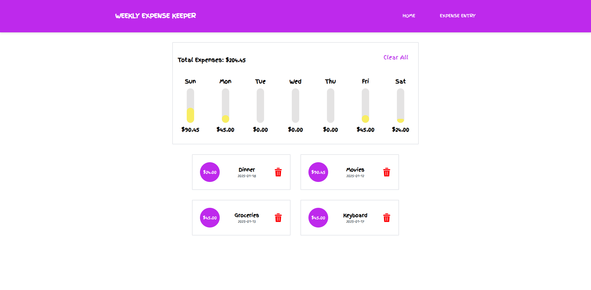

# Weekly Expense Keeper

The Weekly Expense Keeper app tracks your weekly transactions and displays them visually using an intuitive bar chart.

## Tech Stack

- React, TypeScript & Tailwind CSS

## Setup Instructions

1. **Clone the Repository**

   ```
   git clone https://github.com/EziOPratikk/weekly-expense-keeper.git
   ```

2. **Install dependencies:**

   ```
   npm install
   ```

3. **Run the development server:**

   ```
   npm run dev
   ```

## Screenshots


